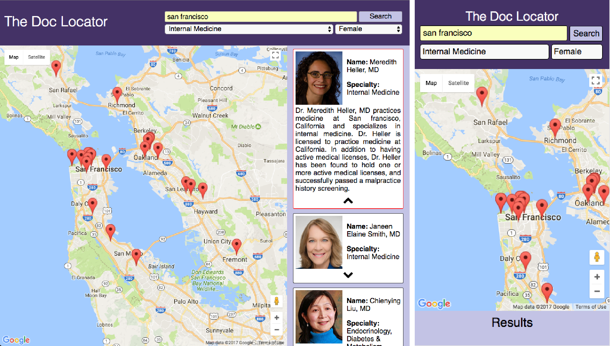

# The Doc Locator
First capstone project for Thinkful's [Flexible Web Development Bootcamp](https://www.thinkful.com/bootcamp/web-development/flexible/) designed to showcase the use of APIs, AJAX calls, and original app development from start to finish.

## Summary
The Doc Locator allows the user to input a city, address, or zipcode and retrieve a list of doctors located nearby. The search results are displayed as both a list and on Google Maps to aid the user in browsing nearby doctors. Search results can be filtered based on physician specialty and gender.

## Live Site
To see The Doc Locator in action visit [https://iastanley.github.io/capstone1_theDocLocator](https://iastanley.github.io/capstone1_theDocLocator/)

## Implementation
* The physician location and other meta data are available via the [BetterDoctor.com](https://betterdoctor.com/) API.
* Geocoding and map visualization is provided by the Google Maps Javascript API.    
* Form submission, asynchronous API calls (AJAX), and DOM manipulation were done using Javascript and jQuery.
* A responsive and mobile ready site was built using HTML5 and CSS3.
